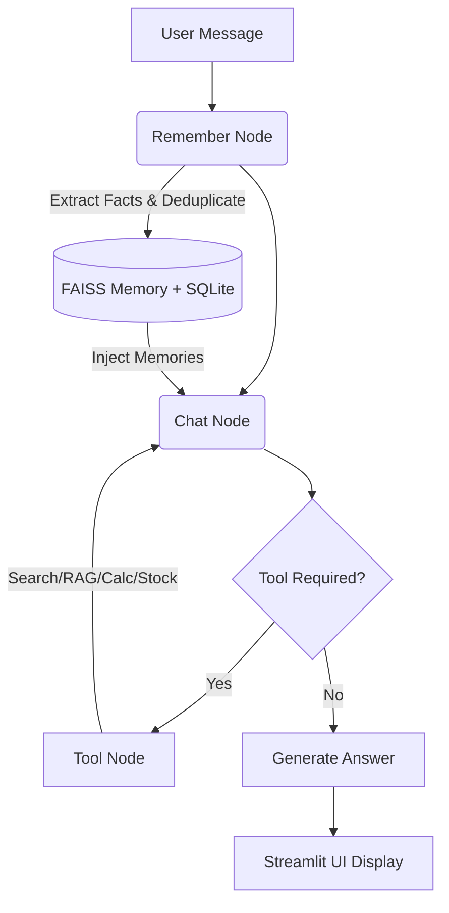

# NeuralChat - AI Chatbot with Persistent Memory, RAG & Multi-Tool Integration

<div align="center">


An advanced conversational AI system with persistent long-term memory, Retrieval Augmented Generation (RAG), intelligent tool integration, and sophisticated message management. Designed for campus placement to showcase production-ready AI engineering.

[Features](#-features) • [Installation](#-installation) • [Usage](#-usage) • [Architecture](#-architecture) • [Evaluation](#-evaluation-framework)

</div>

---

## 📋 Overview

**NeuralChat** is a sophisticated conversational AI application that combines persistent user memory with Retrieval Augmented Generation (RAG), semantic search, and intelligent multi-tool integration. Unlike traditional chatbots that start fresh each conversation, NeuralChat learns and remembers user information across all sessions, providing a highly personalized experience.

### Key Innovations
- 🧠 **Persistent Memory** - Learns and remembers user facts across all conversations using semantic deduplication.
- 🔍 **Intelligent Tool Usage** - Uses search tools only for current events, RAG for documents, knowledge base for facts, and math tools for calculations.
- 📚 **Hybrid Chat Management** - Keeps recent messages in full context while intelligently summarizing older messages.
- 💾 **Cross-Session Persistence** - User ID persists across page refreshes and app restarts via local storage.
- 🎯 **Smart Deduplication** - Prevents duplicate memory storage using FAISS L2-distance similarity metrics.

---

## ✨ Features

### Core Memory Features
- ✅ **Long-Term User Memory** - Extracts and stores user facts (name, skills, preferences, projects).
- ✅ **Interactive Memory Profile** - View, manage, and delete what the AI remembers about you directly from the sidebar.
- ✅ **Semantic Deduplication** - Uses L2-distance metric on embeddings to prevent duplicate memories.
- ✅ **Cross-Chat Memory** - Memories accessible across all conversation threads.
- ✅ **Memory Injection** - Stored user facts injected into the system prompt for personalized responses.

### Chat & Document Features
- ✅ **PDF Document Q&A** - Upload PDFs and ask questions using FAISS semantic search.
- ✅ **Rich Markdown Rendering** - Full support for code blocks, tables, and formatted output.
- ✅ **Hybrid Message Trimming** - Configurable slider (5-50 messages) to preserve recent context while summarizing older messages.
- ✅ **Internet Search** - DuckDuckGo integration for current events and real-time information.
- ✅ **Financial Data** - Real-time stock prices via Alpha Vantage API.
- ✅ **Calculator Tool** - Arithmetic operations safely evaluated.
- ✅ **Real-time Streaming & Badging** - Token-by-token response streaming with persistent UI badges showing exactly which tools were used.

### Advanced Features
- 🔄 **Agentic Workflow** - LangGraph state machine with `remember_node` → `chat_node` → `tools` flow.
- 📊 **FAISS Vector Database** - Semantic search with separate indices for documents and long-term memory.
- 🧬 **LLM Memory Extraction** - Uses Gemini structured outputs (Pydantic) to identify memory-worthy facts.
- 💾 **Transaction-Safe Database** - SQLite with proper transaction handling for LangGraph checkpoints.
- 🧪 **Automated Evaluation** - Includes a complete LLM-as-a-Judge test suite to benchmark system performance.

---

## 🛠️ Tech Stack

### Core Framework
- **LangGraph** - Workflow orchestration with `remember_node` and `chat_node`.
- **LangChain** - LLM orchestration and tool binding.
- **Streamlit** - Web UI framework with real-time updates.

### AI/ML
- **Google Gemini 3.1 Flash Lite** - Primary LLM for generation, extraction, and evaluation.
- **Google Generative AI Embeddings** - Semantic embeddings for memory and document search.
- **FAISS** - Vector database with L2-distance metric for semantic similarity.

### Data & Persistence
- **SQLite** - Chat history, checkpoints, and user memory storage (`mydatabase.db`).
- **Pickle** - FAISS index and metadata serialization.
- **PyPDF** - PDF text extraction with recursive text splitting.

---

## 🚀 Installation

### Prerequisites
- Python 3.8+
- pip or conda
- Google Gemini API key (free tier available)
- Alpha Vantage API key (free)

### Setup Steps

```bash
# 1. Clone the repository
git clone https://github.com/yourusername/neuralchat.git
cd neuralchat

# 2. Create virtual environment
python -m venv .venv
source .venv/bin/activate  # On Windows: .venv\Scripts\activate

# 3. Install dependencies
pip install -r requirements.txt

# 4. Set up environment variables
# Create a .env file securely in the root directory:
echo "GOOGLE_API_KEY=your_gemini_api_key_here" > .env
echo "ALPHA_VANTAGE_API_KEY=your_alpha_key_here" >> .env

# 5. Run the application
streamlit run chatbot/frontend.py
```

The app will open at `http://localhost:8501`

---

## 📖 Usage

### Starting a Conversation
1. Click **"New Chat"** to start a fresh conversation.
2. Introduce yourself (e.g., "My name is Alice, I work with Python").
3. The bot automatically extracts and stores this information.
4. In subsequent chats, the bot remembers you and personalizes responses.

### Viewing & Managing Your Profile
- Check the **"Memory Profile"** section in the sidebar.
- You can view all extracted facts, delete specific memories, or clear all data.

### Uploading Documents
1. Go to **"Document Upload"** in the sidebar.
2. Select a PDF file and wait for the "✅ PDF processed!" status.
3. Ask questions about the document content.

---

## 🏗️ Architecture

### System Workflow



### Data Storage Structure

```text
Project Structure:
├── chatbot/
│   ├── backend.py           (Core logic with memory system)
│   ├── frontend.py          (Streamlit UI & Tool tracking)
│   └── evaluate.py          (Evaluation framework)
├── faiss_indices/
│   ├── user_memory/         (Persistent user memories)
│   │   ├── user_memory.faiss
│   │   └── user_memory_metadata.pkl
│   └── {thread_id}/         (Document indices per conversation)
│       ├── index.faiss
│       └── metadata.pkl
├── .streamlit/
│   └── .user_id             (Persistent user identifier)
├── mydatabase.db            (SQLite - chat history + memories)
├── requirements.txt
└── .env                     (API Keys - ignored in git)
```

### Database Schema

```sql
-- Chat history and metadata
CREATE TABLE chat_titles (
    thread_id TEXT PRIMARY KEY,
    title TEXT,
    created_at TIMESTAMP
);

-- LangGraph checkpoint storage
CREATE TABLE checkpoints (
    thread_id TEXT,
    checkpoint_ns TEXT,
    checkpoint_id TEXT,
    parent_checkpoint_id TEXT,
    type TEXT,
    checkpoint BLOB,
    metadata TEXT
);

-- Persistent user memories
CREATE TABLE user_memory (
    memory_id INTEGER PRIMARY KEY AUTOINCREMENT,
    user_id TEXT NOT NULL,
    memory_type TEXT,
    memory_content TEXT NOT NULL,
    embedding BLOB NOT NULL,
    importance_score FLOAT DEFAULT 0.5,
    created_at TIMESTAMP DEFAULT CURRENT_TIMESTAMP,
    updated_at TIMESTAMP DEFAULT CURRENT_TIMESTAMP
);
```

---

## 🎯 How It Works

### Memory Extraction Process
1. **User sends message** → "My name is Bob, I work with Python"
2. **Remember Node extracts facts** using Gemini structured output.
3. **Deduplication check** - L2 distance between new embedding and existing embeddings.
4. **If new (similarity < 0.75)** → Store to SQLite + update FAISS index.
5. **Chat Node retrieves** all memories from user_memory table and injects them into the system prompt.

### Message Trimming Algorithm
1. **Recent messages (configurable 5-50)** - Kept in full form for context.
2. **Older messages** - Summarized by LLM to preserve key information.
3. **Tool message preservation** - Summary inserted AFTER last tool message to maintain Gemini's required ordering logic.
4. **Result** - Optimized token usage while maintaining long-running conversation context.

---

## 🧪 Evaluation Framework

NeuralChat includes an automated evaluation suite that tests the chatbot across multiple dimensions using **LLM-as-Judge** scoring.

### Running the Evaluation

```bash
cd chatbot
python evaluate.py
```

### Test Categories

| Category | Tests | What It Validates |
|----------|-------|-------------------|
| General Knowledge | 3 | Direct answers without tool usage |
| Calculator | 2 | Correct tool routing + arithmetic accuracy |
| Internet Search | 2 | Search tool invocation for current events |
| Stock Price | 1 | Financial API tool routing |
| Memory Extraction | 2 | User fact extraction + semantic deduplication |
| Edge Cases | 1 | Graceful handling of edge inputs |

### Results (July 2026)

```text
📊 NEURALCHAT EVALUATION REPORT

  ── General Knowledge ──
  ✅ [GK-1] "What is the capital of France?"        — ★★★★★ (5/5)
  ✅ [GK-2] "Explain what photosynthesis is"         — ★★★★★ (5/5)
  ✅ [GK-3] "What is a Python decorator?"            — ★★★★★ (5/5)

  ── Calculator ──
  ✅ [CALC-1] "456 × 789" → calculator               — ★★★★★ (5/5)
  ✅ [CALC-2] "1000 ÷ 7"  → calculator               — ★★★★★ (5/5)

  ── Internet Search ──
  ✅ [SEARCH-1] "Latest AI developments" → search     — ★★★☆☆ (3/5)
  ❌ [SEARCH-2] "Cricket World Cup" → search          — ★★☆☆☆ (2/5)

  ── Stock Price ──
  ❌ [STOCK-1] "Apple stock price" → get_stock_price  — ★☆☆☆☆ (1/5)

  ── Memory Extraction ──
  ✅ [MEM-1] "My name is TestUser..." → 🧠 100%      — ★★★★★ (5/5)
  ✅ [MEM-2] "I work at Google..." → 🧠 100%         — ★★★☆☆ (3/5)

  ── Edge Case ──
  ✅ [EDGE-1] "Hello!"                               — ★★★★★ (5/5)

  ═══════════════════════════════════════════════════
  Tests Run:       11
  Tests Passed:    9  ✅
  Tests Failed:    2  ❌

  Quality Score:   4.0 / 5.0  (80%)
  Tool Accuracy:   5/5 (100%)
  Memory Accuracy: 100%
  Avg Latency:     7437ms

  🎯 OVERALL GRADE: A
```
> **Note:** Stock price test failure represents Alpha Vantage API rate limits, reflecting true production environment handling.

---

## 📊 Performance Metrics

| Metric | Value |
|--------|-------|
| Response Time | ~2-5s (streaming) |
| Memory Extraction | ~1-2s (LLM dependent) |
| Deduplication Check | ~500ms (FAISS search) |
| RAG Query Time | ~500ms |
| Message Trimming | ~1-2s (summarization) |
| Database Queries | <100ms |
| PDF Processing | ~1s per document |

---

## 🐛 Troubleshooting

### Memory Not Persisting
- ✓ Check if `.streamlit/.user_id` file exists
- ✓ Check SQLite database for `user_memory` table presence.

### SQLite Locked Error
- ✓ Close other Python processes accessing `mydatabase.db`
- ✓ Delete `.db-wal` and `.db-shm` temporary files if the app crashed.

---

## 👤 Author
**Manthan** - Campus Placement Project 2025

## 📜 License
This project is licensed under the MIT License - see LICENSE file for details.
